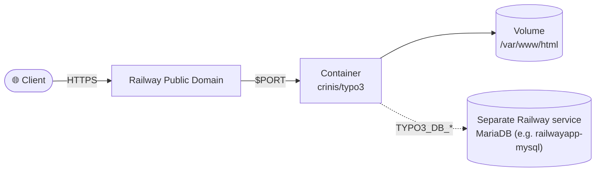

# TYPO3 Railway.app Template


<p align="center">
  
</p>

This template helps you spin up a TYPO3 installation quickly with Docker and Railway.app.

[](https://railway.com/deploy/typo3?referralCode=2_sIT9&utm_medium=integration&utm_source=template&utm_campaign=generic)

## Features

- TYPO3 12.4 LTS
- MariaDB 10.11
- Tuned Docker setup
- Health checks for more stable runs
- Environment variables for safer configuration

## 🏗️ Architecture



## Prerequisites

- Docker and Docker Compose
- Railway.app CLI (optional, for Railway.app deployment)

## Quick start

1. Clone the repository:

   ```bash
   git clone https://github.com/yourusername/railwayapp-typo3.git
   cd railwayapp-typo3
   ```

2. Configure environment variables:

   ```bash
   cp .env.example .env
   ```

   Edit `.env` and set strong passwords.

3. Start the containers:

   ```bash
   docker compose up -d
   ```

4. Open TYPO3 at [http://localhost:8080](http://localhost:8080).

## Configuration

### Environment variables

| Variable               | Description              | Default     |
|------------------------|--------------------------|-------------|
| `TYPO3_ADMIN_USERNAME` | Admin username           | `admin`     |
| `TYPO3_ADMIN_PASSWORD` | Admin password           | —           |
| `TYPO3_DB_NAME`        | Database name            | `typo3`     |
| `TYPO3_DB_USERNAME`    | Database user            | `typo3`     |
| `TYPO3_DB_PASSWORD`    | Database password        | —           |
| `MYSQL_ROOT_PASSWORD`  | MariaDB root password    | —           |
| `TYPO3_CONTEXT`        | TYPO3 application context | `Development` |
| `TZ`                   | Time zone                | `Europe/Berlin` |

### Volumes

- `railway-typo3-app`: TYPO3 files
- `railway-typo3-db`: MariaDB data

On Railway, this Dockerfile builds the TYPO3 service only. `railway.toml` declares `requiredMountPath = "/var/www/html"` so a Railway volume is enforced for `fileadmin`, `typo3conf`, and uploads. Deploy MariaDB as its own Railway service (e.g. via a MySQL-compatible plugin or the `railwayapp-mysql` template) with its own volume — the two containers in `docker-compose.yml` are meant to become two separate Railway services in production, not one.

### Database (Docker Compose)

From the TYPO3 container, the database host is `db`. User, password, and database name are the values you set in `.env` (`TYPO3_DB_*`). See `docker-compose.yml` for how they are wired.

## Deploying to Railway.app

1. Install the Railway.app CLI.
2. Initialize the project:

   ```bash
   railway init
   ```

3. Set environment variables:

   ```bash
   railway variables set TYPO3_ADMIN_PASSWORD=your-secure-password
   railway variables set TYPO3_DB_PASSWORD=your-secure-password
   railway variables set MYSQL_ROOT_PASSWORD=your-secure-password
   ```

4. Deploy:

   ```bash
   railway up
   ```

## Railway runtime defaults

This template uses `railway.toml` with these defaults:

- Build via `DOCKERFILE`
- Health check on `/`
- Restart policy `ON_FAILURE` with a maximum number of retries

## Security

- Sensitive values are configured through environment variables
- Default passwords are not baked into the image
- Health checks for more stable operation
- Tuned MariaDB configuration

## Support

Open an issue in the GitHub repository if you have questions or run into problems.

## License

GNU General Public License v3.0 — see the [LICENSE](LICENSE) file for details.

<!-- footer -->
---

[](https://github.com/vergissberlin/railwayapp-airbyte) [](https://github.com/vergissberlin/railwayapp-airflow) [](https://github.com/vergissberlin/railwayapp-cloudbeaver-ce) [](https://github.com/vergissberlin/railwayapp-codimd) [](https://github.com/vergissberlin/railwayapp-django) [](https://github.com/vergissberlin/railwayapp-email) [](https://github.com/vergissberlin/railwayapp-fastapi) [](https://github.com/vergissberlin/railwayapp-flask) [](https://github.com/vergissberlin/railwayapp-flowise) [](https://github.com/vergissberlin/railwayapp-gitlab) [](https://github.com/vergissberlin/railwayapp-grafana) [](https://github.com/vergissberlin/railwayapp-homeassistant) [](https://github.com/vergissberlin/railwayapp-influxdb) [](https://github.com/vergissberlin/railwayapp-mjml) [](https://github.com/vergissberlin/railwayapp-mongodb) [](https://github.com/vergissberlin/railwayapp-mqtt) [](https://github.com/vergissberlin/railwayapp-mysql) [](https://github.com/vergissberlin/railwayapp-n8n) [](https://github.com/vergissberlin/railwayapp-nodejs) [](https://github.com/vergissberlin/railwayapp-nodered) [](https://github.com/vergissberlin/railwayapp-opensearch) [](https://github.com/vergissberlin/railwayapp-outerbase-studio) [](https://github.com/vergissberlin/railwayapp-postgresql) [](https://github.com/vergissberlin/railwayapp-redis) [](https://github.com/vergissberlin/railwayapp-typo3)
